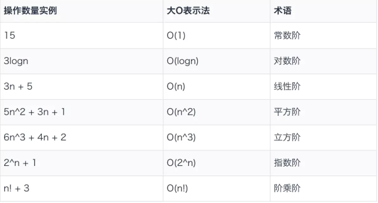

## 算法复杂度
引用[算法的时间复杂度和空间复杂度](https://juejin.im/entry/5a49f7d36fb9a0450a67b269)
[JavaScript 算法之复杂度分析](https://juejin.im/post/5c2a1d9d6fb9a04a0f654581#heading-13)

分为两种：
* `时间复杂度`：**评估执行程序所需的时间。可以估算出程序对处理器的使用程度**；
* `空间复杂度`：**评估执行程序所需的存储空间。可以估算出程序对计算机内存的使用程度**；

### 时间复杂度
把一个算法中的语句执行次数称为`时间频度`，用`T(n)`表示；

一般情况下算法基础本操作的重复执行次数为问题规模n的某个函数，用也就是时间频度`T(n)`。如果有某个辅助函数`f(n)`，当趋于无穷大的时候，`T(n)/f(n)`的极限值是不为零的某个常数，那么`f(n)`是`T(n)`的同数量级函数，记作`T(n)=O(f(n))`，被称为 **算法的渐进时间复杂度**，又简称为 **时间复杂度**。

#### 大O表示法

**用O(n)来体现算法时间复杂度的记法被称作大O表示法**

常见算法时间复杂度：
* O(1)：常数阶；
* O(logn)：对数阶；
* O(n)：线性阶；
* O(nlogn)：n次对数阶；
* O(n^2)：平方阶；
* O(n^3)：立方阶；
* O(2^n)：指数阶；
* O(n!)：阶乘阶；



从上到下复杂度依次递增
```js
{
  O(1) < O(logn) < O(n) < O(nlogn) < O(n²) < O(n³) < O(2ⁿ) < O(n!)
}
```
<br />

**推导大O阶**

推导大O阶有一下三种规则：
1. **用常数1取代运行时间中的所有加法常数**；
2. **只保留最高阶项**；
3. **去除最高阶的常数**；

例子：

* 常数阶
```js
{
  let sum = 0, n = 10; // 语句执行一次
  let sum = (1+n)*n/2; // 语句执行一次
  console.log(`The sum is : ${sum}`) //语句执行一次
}
```
这样的一段代码它的执行次数为 3 ，然后我们套用规则1，则这个算法的时间复杂度为O(1)，也就是常数阶。

* 线性阶
```js
{
  let i =0; // 语句执行一次
  while (i < n) { // 语句执行n次
    console.log(`Current i is ${i}`); //语句执行n次
    i++; // 语句执行n次
  }
}
```
这个算法中代码总共执行了 3n + 1次，根据 **规则 2->3**，因此该算法的时间复杂度是O(n)。

* 对数阶
```js
let number = 1; // 语句执行一次
while (number < n) { // 语句执行logn次
  number *= 2; // 语句执行logn次
}
```
上面的算法中，number每次都放大两倍，我们假设这个循环体执行了m次，那么`2^m = n`即`m = logn`，所以整段代码执行次数为`1 + 2*logn`，则`f(n) = logn`，时间复杂度为O(logn)。

* 平方阶
```js
for (let i = 0; i < n; i++) { // 语句执行n次
  for (let j = 0; j < n; j++) { // 语句执行n^2次
     console.log('I am here!'); // 语句执行n^2
  }
}
```
上面的嵌套循环中，代码共执行 `2*n^2 + n`，则`f(n) = n^2`。所以该算法的时间复杂度为O(n^2 )

### 空间复杂度

所谓 **空间复杂度就是表示算法的存储空间和数据规模之间的关系**。

比如说分析下面代码的空间复杂度：
```js
{
  function initArr(n) {
    var arr = [];
    for (var i = 0; i < n; i++) {
      arr[i] = i;
    }
  }
}
```

复制代码根据时间复杂度的推算，忽略掉常数量级，每次数组赋值都会申请一个空间存储变量，所以此函数的空间复杂度为 O(n)。
常见的空间复杂度只有 O(1)、O(n)、O(n2)。其他的话很少会用到。
