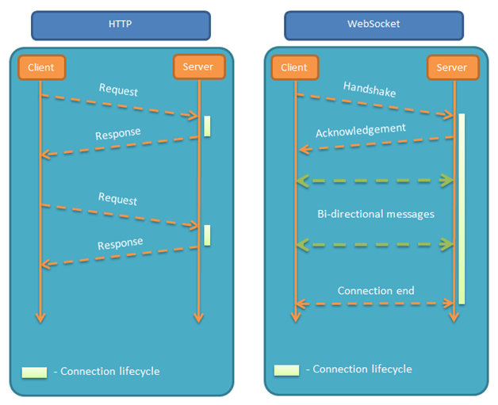
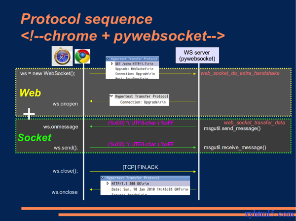

## WebSocket
<br />

 [JavaScript服务器推送技术之 WebSocket](https://segmentfault.com/a/1190000013131251)
<br />

#### 1、WebSocket优势和特点

-|短轮询|长轮询|Websocket|sse|
:-:|:-:|:-:|:-:|:-:|:-:
通信方式|http|http|	基于TCP长连接通讯|http
触发方式|轮询|轮询|事件|事件
优点|兼容性好容错性强，实现简单|比短轮询节约资源|全双工通讯协议，性能开销小、安全性高，有一定可扩展性|全性高，有一定可扩展性	实现简便，开发成本低
缺点|安全性差，占较多的内存资源与请求数|安全性差，占较多的内存资源与请求数|传输数据需要进行二次解析，增加开发成本及难度|只适用高级浏览器
适用范围|b/s服务|b/s服务|网络游戏、银行交互和支付|服务端到客户端单向推送
解释|间隔发送ajax|调整ajax保持请求连通，服务器回复后断开|全双工通信方案|保持通信，发送消息后继续连接

特点：
* **易实现**：建立在TCP协议上，服务器断实现容易；
* **兼容高**：与HTTP协议有良好兼容性，默认端口为80和443，握手阶段采用HTTP协议，因此握手时不容易屏蔽，能通过各种HTTP代理服务器；
* **请求轻量**：数据格式比较轻量，性能开销小，通信高效。服务器与客户端之间交换的标头信息大概只有2字节；
* **文本和二进制都能发送**：可以发送文本，也可以发送二进制数据；
* **无同源限制**：没有同源限制，客户端可以与任意服务器通信；
* **可以加密**：协议标识符是`ws`（如果加密，则为wss），服务器网址就是 URL。ex：`ws://example.com:80/some/path`；
* **性能好**：不用频繁创建及销毁TCP请求，减少网络带宽资源的占用，同时也节省服务器资源；
* **纯事件驱动**：WebSocket是纯事件驱动的，一旦连接建立，通过监听事件可以处理到来的数据和改变的连接状态，数据都以帧序列的形式传输。服务端发送数据后，消息和事件会异步到达；
* **无超时处理**；

##### HTTP与WS协议结构
WebSocket协议标识符用`ws`表示。wss协议表示加密的WebSocket协议，对应HTTPs协议。结构如下：
* HTTP: TCP > HTTP
* HTTPS: TCP > TLS > HTTP
* WS: TCP > WS
* WSS: TCP > TLS > WS

##### 2、WebSocket的通信过程
首先，Websocket是一个持久化的协议，相对于HTTP这种非持久的协议来说。

Websocket 其实是一个新协议，但是为了兼容现有浏览器的握手规范而借用了HTTP的协议来完成一部分握手。

WebSocket是纯事件驱动的，一旦连接建立，通过监听事件可以处理到来的数据和改变的连接状态，数据都以帧序列的形式传输。服务端发送数据后，消息和事件会异步到达。WebSocket编程遵循一个异步编程模型，只需要对WebSocket对象增加回调函数就可以监听事件。

###### 2.1、WebSocket通信流程图


这里可以看出传统HTTP通讯与WebSocket通讯的通信流程上的区别，下图显示WebSocket主要的三步中浏览器和服务器端分别做了哪些事情。



###### 2.2、WebSocket通信流程图

当Web应用程序调用new WebSocket(url)接口时，客户端就开始了与地址为url的WebServer建立握手连接的过程。

1. 客户端与服务端通过TCP三次握手建立连接，如果这个建立连接失败，那么后面的过程就不会执行，Web应用程序将收到错误消息通知。
2. 在TCP建立连接成功后，客户端通过HTTP协议传送WebSocket支持的版本号、协议的字版本号、原始地址、主机地址等等一些列字段给服务器端。
3. 服务端收到客户端发送来的握手请求后，如果数据包数据和格式正确、客户端和服务端的协议版本号匹配等等，就接受本次握手连接，并给出相应的数据回复，同样回复的数据包也是采用HTTP协议传输。
4. 客户端收到服务端回复的数据包后，如果数据包内容、格式都没有问题的话，就表示本次连接成功，触发`onopen`，此时Web开发者就可以在此时通过`send()`向服务器发送数据。否则握手连接失败，Web应用程序触发`onerror`，并且能知道连接失败的原因。

这个握手很像HTTP，但是实际上却不是，它允许服务器以HTTP的方式解释一部分handshake的请求，然后切换为websocket。

###### 2.3、WebSocket握手报文
一个浏览器发出的WebSocket请求报文类似于：
```js
{
  GET /chat HTTP/1.1
  Host: server.example.com
  Upgrade: websocket
  Connection: Upgrade
  Sec-WebSocket-Key: x3JJHMbDL1EzLkh9GBhXDw==
  Sec-WebSocket-Protocol: chat, superchat
  Sec-WebSocket-Version: 13
  Origin: http://example.com
}
```

HTTP1.1协议规定，Upgrade头信息表示将通信协议从HTTP/1.1转向该项所指定的协议。

* Connection: Upgrade表示浏览器通知服务器，如果可以，就升级到webSocket协议。
* Origin用于验证浏览器域名是否在服务器许可的范围内。
* Sec-WebSocket-Key则是用于握手协议的密钥，是浏览器生成的Base64编码的16字节随机字符串。
* Sec-WebSocket-Protocol是一个用户定义的字符串，用来区分同URL下，不同的服务所需要的协议。
* Sec-WebSocket-Version是告诉服务器所使用的协议版本。

服务端WebSocket回复报文：

```js
{
  HTTP/1.1 101 Switching Protocols
  Upgrade: websocket
  Connection: Upgrade
  Sec-WebSocket-Accept: HSmrc0sMlYUkAGmm5OPpG2HaGWk=
  Sec-WebSocket-Protocol: chat
  Sec-WebSocket-Origin: null
  Sec-WebSocket-Location: ws://example.com/
}
```

* 服务器端同样用Connection: Upgrade通知浏览器，服务端已经成功切换协议。
* Sec-WebSocket-Accept是经过服务器确认并且加密过后的Sec-WebSocket-Key。
* Sec-WebSocket-Location表示进行通信的WebSocket网址。
* Sec-WebSocket-Protocol表示最终使用的协议。

在这样一个类似于HTTP通信的握手结束之后，下面就按照WebSocket协议进行通信了。客户端与服务器之间不会再发生HTTP通信，一切由WebSocket 协议接管。

##### 3、WebSocket API
实例：
```js
{
  var ws = new WebSocket("wss://echo.websocket.org");

  ws.onopen = function(evt) {
    console.log("Connection open ...");
    ws.send("Hello WebSockets!");
  };

  ws.onmessage = function(evt) {
    console.log("Received Message: " + evt.data);
    ws.close();
  };

  ws.onclose = function(evt) {
    console.log("Connection closed.");
  };
}
```
###### 3.0、ws.readyState 当前状态
状态|值|描述
-|:-:|-
CONNECTING|0|连接还没开启。
OPEN|1|连接已开启并准备好进行通信。
CLOSING|2|连接正在关闭的过程中。
CLOSED|3|连接已经关闭，或者连接无法建立。

一个示例：
```js
{
  switch (ws.readyState) {
    case WebSocket.CONNECTING:
      // ...
      break;
    case WebSocket.OPEN:
      // ...
      break;
    case WebSocket.CLOSING:
      // ...
      break;
    case WebSocket.CLOSED:
      // ...
      break;
    default:
      //  this never happens
      break;
  }
}
```

###### 3.1、ws.onopen 成功连接
实例对象的`onopen`属性，用于指定连接成功后的回调函数。
```js
{
  ws.onopen = function () {
    ws.send('Hello Server!');
  };
}
```
如果要指定多个回调函数，可以`addEventListener`。
```js
{
  ws.addEventListener('open', function (event) {
    ws.send('Hello Server!');
  });
}
```
###### 3.2、ws.onclose 关闭连接
实例对象的`onclose`属性，用于指定连接关闭后的回调函数。
```js
{
  ws.onclose = function(event) {
      const { code, reason, wasClean} = event
      // ...
  };
  ws.addEventListener('close', function(event) {
      const { code, reason, wasClean} = event
      // ...
  })
}
```
###### 3.3、ws.onmessage 收到数据
实例对象的`onmessage`属性，用于指定收到服务器数据后的回调函数。
```js
{
  ws.onmessage = function(event) {
    const { data } = event;
    // ...
  };
  ws.addEventListener('message', function(event) {
    const { data } = event;
    // ...
  });
}
```
注意，服务器数据可能是文本，也可能是二进制数据（`blob`对象或`Arraybuffer`对象）。
```js
{
  ws.onmessage = function(event){
    if(typeof event.data === String) {
      // string
    }
    if(event.data instanceof ArrayBuffer){
      const { data: buffer } = event;
      // array buffer
    }
  }
}
```
###### 3.4、ws.binaryType 指定数据类型
除了动态判断收到的数据类型，也可以使用`binaryType`属性，显式指定收到的二进制数据类型。`binaryType`取值应当是'blob'或者'arraybuffer'，'blob'表示使用 Blob 对象，而'arraybuffer'表示使用 ArrayBuffer 对象。
```js
{
  ws.binaryType = 'blob';                // 收到的是 Blob 数据
  ws.onmessage = function(e) {
    console.log(e.data.size);
  };

  ws.binaryType = 'arraybuffer';            // 收到的是 ArrayBuffer 数据
  ws.onmessage = function(e) {
    console.log(e.data.byteLength);
  };
}
```
###### 3.5、ws.bufferedAmount 判断发送是否成功
实例对象的`bufferedAmount`只读属性，表示还有多少字节的二进制数据没有发送出去。它可以用来判断发送是否结束。 该值会在所有队列数据被发送后重置为 0，而当连接关闭时不会设为0。如果持续调用send()，这个值会持续增长。
```js
{
  var data = new ArrayBuffer(10000000);
  ws.send(data);
  if (ws.bufferedAmount === 0) {
    // 发送完毕
  } else {
    // 发送还没结束
  }
}
```
###### 3.6、ws.onerror 报错回调
实例对象的`onerror`属性，用于指定报错时的回调函数。
```js
{
  ws.onerror = function(event) {
    // handle error event
  };
  ws.addEventListener("error", function(event) {
    // handle error event
  });
}
```
###### 3.7、ws.close()
关闭WebSocket连接或停止正在进行的连接请求。如果连接的状态已经是closed，这个方法不会有任何效果。
###### 3.8、ws.send()
实例对象的`send()`方法用于向服务器发送数据。
```js
{
  ws.send('your message');                // 发送文本的例子

  var file = document
    .querySelector('input[type="file"]')
    .files[0];
  ws.send(file);                            // 发送 Blob 对象的例子

  // Sending canvas ImageData as ArrayBuffer   
  var img = canvas_context.getImageData(0, 0, 400, 320);
  var binary = new Uint8Array(img.data.length);
  for (var i = 0; i < img.data.length; i++) {
    binary[i] = img.data[i];
  }
  ws.send(binary.buffer);                // 发送 ArrayBuffer 对象的例子
}
```
