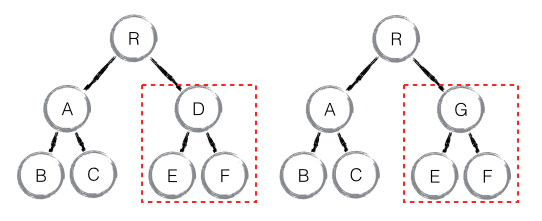

# diff 原理

diff的重要性：作为Virtual DOM的加速器，是React界面渲染的基础。

### diff策略

1. Web UI中节点跨层级的移动操作特别少，可以忽略不记；
2. 拥有相同类的两个组件将会生成相类似的树形结构，拥有不同类的两个组件将会生成不同的树形结构；
3. 对于同一层级的一组子节点，可以通过唯一key来区分；

### tree diff
特点：
1. **对树进行分层比较**，两棵树只会比较同一层次的节点；
2. 如果出现跨层级移动，则会直接删除该节点，在移动后的dom层重新创建该节点；

### component diff

特点：
1. 如果是同一类型的组件，按照原策略继续比较Virtual DOM tree；可通过shouldComponentUpdate()来判断是否需要进行diff；
2. 如果不是同一类型组件，则将组件判断为dirty component，从而替换整个组件下的所有子节点；

### element diff
当节点处于同一层级时，React diff提供了三总节点操作：
1. `INSERT_MARKUP`（插入）：新节点不在老集合里，是全新的节点，需要对新节点执行插入操作；
2. `MOVE_EXISTING`（移动）：在老集合有新Component类型，且element是可更新的类型，generateComponentChildren已调用receiveComponent，这种情况下 prevChild=nextChild，就需要做移动操作，可以复用以前的 DOM 节点。
3. `REMOVE_NODE`（删除）：老 component 类型，在新集合里也有，但对应的 element 不同则不能直接复用和更新，需要执行删除操作，或者老 component 不在新集合里的，也需要执行删除操作。

###　性能优化
1. 减少跨层级移动，可以用css控制节点的隐藏和显示来代替跨层级移动；
2. 同一层级子节点，添加key，只涉及位置变化时，可只移动元素，避免删除和创建等重复操作；
