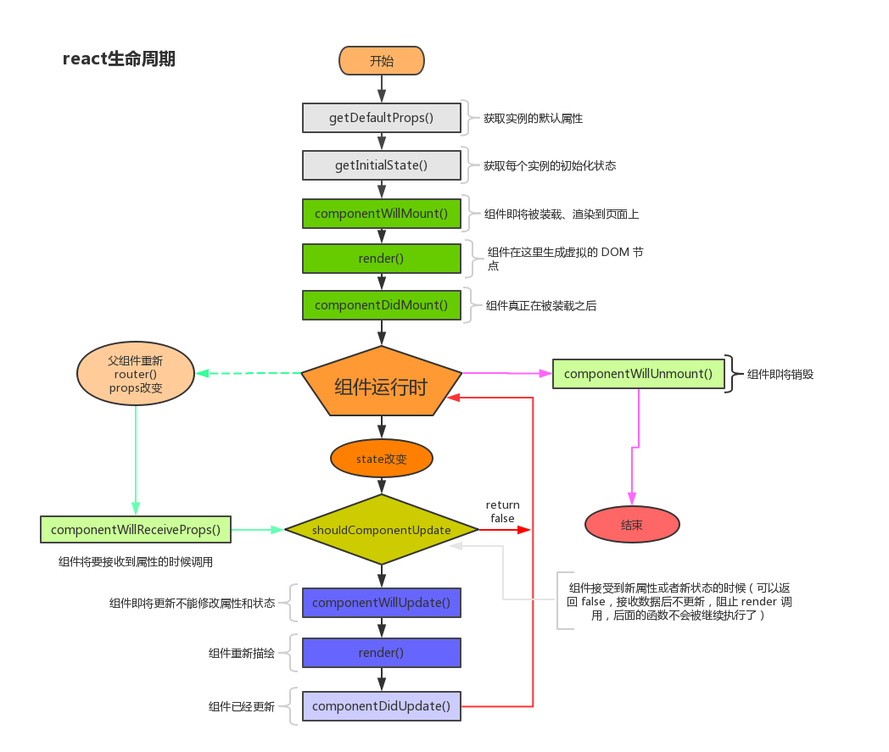

 

* 初始化阶段：
* getDefaultProps:获取实例的默认属性
* getInitialState:获取每个实例的初始化状态
* componentWillMount：组件即将被装载、渲染到页面上
* render:组件在这里生成虚拟的 DOM 节点
* componentDidMount:组件真正在被装载之后
* 运行中状态：
* componentWillReceiveProps:组件将要接收到属性的时候调用
* shouldComponentUpdate:组件接受到新属性或者新状态的时候（可以返回 false，接收数据后不更新，阻止 render 调用，后面的函数不会被继续执行了）
* componentWillUpdate:组件即将更新不能修改属性和状态
* render:组件重新描绘
* componentDidUpdate:组件已经更新
* 销毁阶段：
* componentWillUnmount:组件即将销毁
