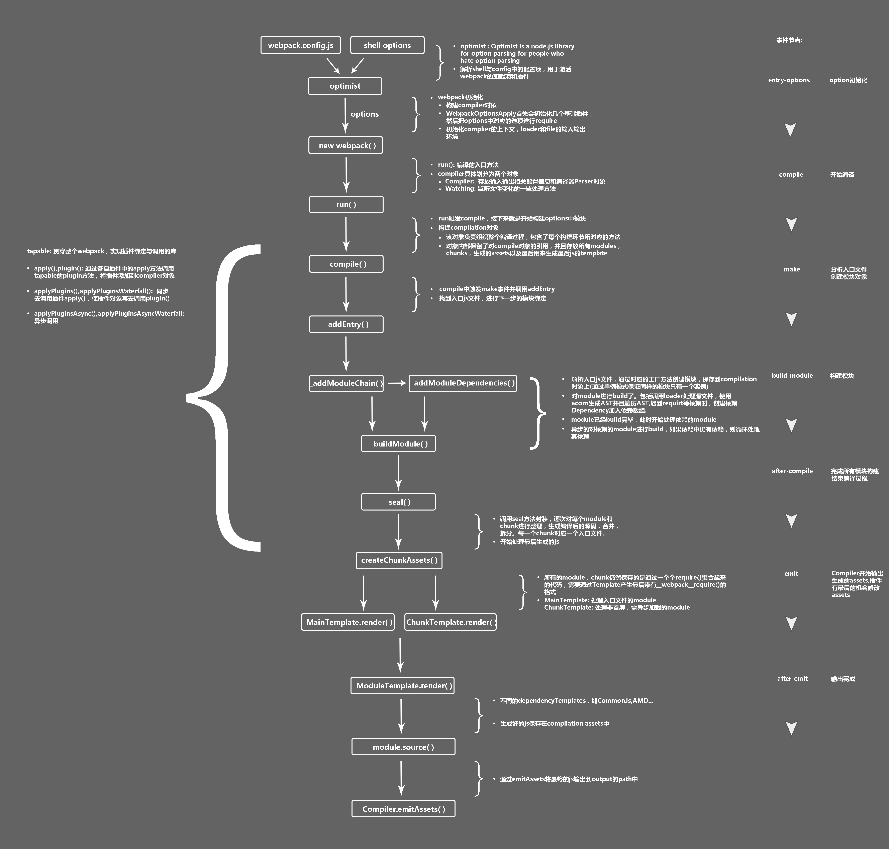
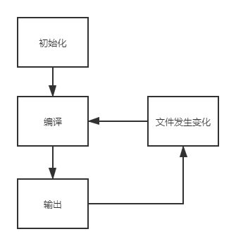

# webpack编译流程

[TOC]

## 1、前言

webpack在web构建工具的激烈竞争中逐渐脱引而出。 无论是编译速度、报错提示、可扩展性等都给前端开发者耳目一新的感觉。

本篇文章是在学习webpack的过程中，从`webpack.config`的`entry`入口到`output`输出，对webpack编译流程的梳理。

这是一张webpack流程图：



## 2、基本概念

以`webpack.config`主要部分进行划分：

1. **Entry**：Webpack 执行构建的第一步将从 Entry 开始，可抽象成输入。
2. **Module**：**在 Webpack 里一切皆模块，一个模块对应着一个文件**。Webpack 会从配置的 Entry 开始递归找出所有依赖的模块。
3. **Chunk**：代码块，一个 Chunk 由多个模块组合而成，用于代码合并与分割。
4. **Loader**：模块转换器，用于把模块原内容按照需求转换成新内容。
5. **Plugin**：扩展插件，在 Webpack 构建流程中的特定时机会广播出对应的事件，插件可以监听这些事件的发生，在特定时机做对应的事情。
6. **output**：定义整个编译过程的终点。

## 3、流程概况

webpack的运行流程是一个串行的过程，从启动到结束会依次执行以下流程：

1. **初始化参数**：从`webpack.config.js`和默认配置中读取与合并参数，得到最终的参数；
2. **开始编译**：用上一步得到的参数初始化 Compiler 对象，加载所有配置的插件，执行对象的 run 方法开始执行编译；
3. **确定入口**：根据配置中的 entry 找出所有的入口文件；
4. **编译模块**：从入口文件出发，调用所有配置的 Loader 对模块进行翻译，再找出该模块依赖的模块，再递归本步骤直到所有入口依赖的文件都经过了本步骤的处理；
5. **完成模块编译**：在经过第4步使用 Loader 翻译完所有模块后，得到了每个模块被翻译后的最终内容以及它们之间的依赖关系；
6. **输出资源**：根据入口和模块之间的依赖关系，组装成一个个包含多个模块的 Chunk，再把每个 Chunk 转换成一个单独的文件加入到输出列表，这步是可以修改输出内容的最后机会；
7. **输出完成**：根据output的配置，确定输出的路径和文件名。

## 4、三大阶段

Webpack 的构建流程可以分为以下三大阶段：

1. **初始化**：启动构建，读取与合并配置参数，加载 Plugin，实例化 Compiler。
2. **编译**：从 Entry 发出，针对每个 Module 串行调用对应的 Loader 去翻译文件内容，再找到该 Module 依赖的 Module，递归地进行编译处理。
3. **输出**：对编译后的 Module 组合成 Chunk，把 Chunk 转换成文件，输出到文件系统。



## 5、初始化阶段

### 5.1、初始化参数

从配置文件和 Shell 语句中读取与合并参数，得出最终的参数。 

> Shell语句的处理一般由`webpack-cli`命令行库工具执行，包括`--config`读取的配置文件，最后才将参数`option`传递给`webpack`。这就是为什么使用Webpack时需要安装这两个lib。

 这个过程中还会执行配置文件中的插件实例化语句 `new Plugin()`。

### 5.2、实例化Compiler

用得到的参数`option`初始化Compiler实例，实例中包含了完整的Webpack默认配置。简化代码如下：

```javascript
const webpack = (options, callback) => {
  let compiler
  if (Array.isArray(options)) {
   	// ...
    compiler = createMultiCompiler(options);
  } else {
    compiler = createCompiler(options);
  }
  // ...
  return compiler; 
}
```

一般全局只有一个`compiler`（多份配置`option`则有多个`compiler`），并向外暴露`run`方法进行启动编译。`Compiler`是负责管理`webpack`整个打包流程的“ 主人公 ”。

Compiler主要负责进行：文件监听与编译，初始化编译过程中的事件Hook。

Compiler类中还声明了用于创建子编译对象`childCompiler`的方法

```javascript
/**
  * @param {Compilation} compilation the compilation
  * @param {string} compilerName the compiler's name
  * @param {number} compilerIndex the compiler's index
  * @param {OutputOptions} outputOptions the output options
  * @param {WebpackPluginInstance[]} plugins the plugins to apply
  * @returns {Compiler} a child compiler
*/
createChildCompiler(
  compilation,
  compilerName,
  compilerIndex,
  outputOptions,
  plugins
) {}
```

用于Loader/插件有需要时创建，执行模块的分开编译。

### 5.3、加载插件

依次调用插件的 `apply` 方法，让插件可以监听后续的所有事件节点。同时给插件传入 `compiler` 实例的引用，以方便插件通过 `compiler` 调用 Webpack 提供的 API。

```javascript
if (Array.isArray(options.plugins)) {
  for (const plugin of options.plugins) {
    if (typeof plugin === "function") {
      plugin.call(compiler, compiler);
    } else {
      plugin.apply(compiler);
    }
  }
}
```

### 5.4、Environment

应用Node的文件系统到compiler对象，方便后续的文件查找和读取

```javascript
new NodeEnvironmentPlugin({
  infrastructureLogging: options.infrastructureLogging
}).apply(compiler);
```

### 5.5、应用默认的webpack配置

剩余的一些钩子：

1. entry-option：读取配置的 `Entrys`，为每个 `Entry` 实例化一个对应的 `EntryPlugin`，为后面该 `Entry` 的递归解析工作做准备。
2. after-plugins：调用完所有内置的和配置的插件的 `apply` 方法。
3. after-resolvers：根据配置初始化完 `resolver`，`resolver` 负责在文件系统中寻找指定路径的文件。

## 6、编译阶段

### 6.1、启动编译

小逻辑，区分是否是`watch`：

1. 如果是非`watch`，则会正常执行一次`compiler.run()`
2. 如果是监听文件（如：`--watch`）的模式，则会传递监听的`watchOptions`，生成Watching实例，每次变化都重新触发回调。

```javascript
function watch(watchOptions, handler) {
  if (this.running) {
    return handler(new ConcurrentCompilationError());
  }

  this.running = true;
  this.watchMode = true;
  return new Watching(this, watchOptions, handler);
}
```

### 6.2、触发compile事件

该事件是为了告诉插件一次新的编译将要启动，同时会给插件带上compiler对象。

### 6.3、Compilation

这是整个webpack构建打包的关键。每一次的编译（包括`watch`检测到文件变化时），`compiler`都会创建一个`Compilation`对象，标识当前的模块资源、编译生成资源、变化的文件等。同时也提供很多事件回调给插件进行拓展。

`Compilation`的生成，是在`compiler`执行`compile`方法时构造的，主要流程大概是：触发`compile`事件后，执行`this.newCompilation`获取新一轮的`compilation`，并作为参数触发`make`事件。然后异步执行此次

```javascript
compile (callback) {
  const params = this.newCompilationParams();
  this.hooks.beforeCompile.callAsync(params, err => {
    // ...
  	this.hooks.compile.call(params);
    const compilation = this.newCompilation(params);
    
    // ...
    this.hooks.make.callAsync(compilation, err => {
      //...
      process.nextTick(() => {
					compilation.finish(err => {
          // ...完成
            this.hooks.afterCompile()
          }
      }                           
  }
}
```

当中还设计到两个主要的钩子：

- complication：这其实是一个同名的hook，是在上述代码`this.newComplication()`中调用的，当其调用时已完成complication的实例化。
- make：表示一个新的`Complication`创建完毕。
- after-compile：表示一次Compilation执行完成

在complication实例化的阶段，调用了Loader转换模块，并将原有的内容结合输出对应的抽象语法树（AST），并递归的分析其导入语句（如`import`等），最终梳理所有模块的依赖关系形成依赖图谱。

当所有模块都经过Loader转换完成，此时触发complication的`seal`事件，根据依赖关系和配置开始着手生成`chunk`。

## 7、输出阶段

1. **should-emit事件**

   所有需要输出的文件已经生成，询问插件有哪些文件需要输出，哪些不需要输出。

2. **emit事件**

   确定好要输出哪些文件后，执行文件输出，可以在这里获取和修改输出的内容。

3. **after-emit事件**

   文件输出完毕

4. **done事件**

   成功完成一次完整的编译和输出流程

## 8、输出文件分析

使用最简单的文件和配置打包：

```javascript
// webpack.config.js配置
const path = require('path');
module.exports = {
  mode: 'none',
  entry: './src/index.js',
  output: {
    filename: 'main.js',
    path: path.resolve(__dirname, 'dist')
  }
};

// src/index.js文件
function component() {
    let element = document.createElement('div');
    element.innerHTML = 'hello webpack';
    return element;
}

document.body.appendChild(component());
```

webpack打包main.js的代码：

```javascript
(function (modules) { // webpackBootstrap
    // The module cache
    var installedModules = {};

    // The require function
    function require(moduleId) {

        // Check if module is in cache
        if (installedModules[moduleId]) {
            return installedModules[moduleId].exports;
        }
        // Create a new module (and put it into the cache)
        var module = installedModules[moduleId] = {
            i: moduleId,
            l: false,
            exports: {}
        };

        // Execute the module function
        modules[moduleId].call(module.exports, module, module.exports, require);

        // Flag the module as loaded
        module.l = true;

        // Return the exports of the module
        return module.exports;
    }


    // expose the modules object (__webpack_modules__)
    require.m = modules;

    // expose the module cache
    require.c = installedModules;

    // define getter function for harmony exports
    require.d = function (exports, name, getter) {
        if (!require.o(exports, name)) {
            Object.defineProperty(exports, name, {enumerable: true, get: getter});
        }
    };

    // define __esModule on exports
    require.r = function (exports) {
        if (typeof Symbol !== 'undefined' && Symbol.toStringTag) {
            Object.defineProperty(exports, Symbol.toStringTag, {value: 'Module'});
        }
        Object.defineProperty(exports, '__esModule', {value: true});
    };

    // create a fake namespace object
    // mode & 1: value is a module id, require it
    // mode & 2: merge all properties of value into the ns
    // mode & 4: return value when already ns object
    // mode & 8|1: behave like require
    require.t = function (value, mode) {
        if (mode & 1) value = require(value);
        if (mode & 8) return value;
        if ((mode & 4) && typeof value === 'object' && value && value.__esModule) return value;
        var ns = Object.create(null);
        require.r(ns);
        Object.defineProperty(ns, 'default', {enumerable: true, value: value});
        if (mode & 2 && typeof value != 'string') for (var key in value) require.d(ns, key, function (key) {
            return value[key];
        }.bind(null, key));
        return ns;
    };

    // getDefaultExport function for compatibility with non-harmony modules
    require.n = function (module) {
        var getter = module && module.__esModule ?
            function getDefault() {
                return module['default'];
            } :
            function getModuleExports() {
                return module;
            };
        require.d(getter, 'a', getter);
        return getter;
    };

    // Object.prototype.hasOwnProperty.call
    require.o = function (object, property) {
        return Object.prototype.hasOwnProperty.call(object, property);
    };

    // __webpack_public_path__
    require.p = "";


    // Load entry module and return exports
    return require(require.s = 0);
})
([
    /* 0 */
    /***/ (function (module, exports) {

        function component() {
            let element = document.createElement('div');
            element.innerHTML = 'hello webpack';
            return element;
        }

        document.body.appendChild(component());

        /***/
    })
]);
```

可以简写为如下：

```javascript
(function(modules) {

  // 模拟 require 语句
  function __webpack_require__() {
  }

  // 执行存放所有模块数组中的第0个模块
  __webpack_require__(0);

})([/*存放所有模块的数组*/])
```

`main.js` 能直接运行在浏览器中的原因在于输出的文件中通过 `__webpack_require__` 函数定义了一个可以在浏览器中执行的加载函数来模拟 Node.js 中的 `require` 语句。

原来一个个独立的模块文件被合并到了一个单独的 `main.js` 的原因在于浏览器不能像 Node.js 那样快速地去本地加载一个个模块文件，而必须通过网络请求去加载还未得到的文件。 如果模块数量很多，加载时间会很长，因此把所有模块都存放在了数组中，执行一次网络加载。

如果仔细分析 `__webpack_require__` 函数的实现，你还有发现 Webpack 做了缓存优化： 执行加载过的模块不会再执行第二次，执行结果会缓存在内存中，当某个模块第二次被访问时会直接去内存中读取被缓存的返回值。

### 分割代码时的输出

修改源代码为：

```javascript
// 异步加载 show.js
import('./show').then((show) => {
  // 执行 show 函数
  show('Webpack');
});
```

重新构建后会输出两个文件，分别是执行入口文件 `main.js` 和 异步加载文件 `0.main.js`。

其中 `0.main.js` 内容如下：

```javascript
// 加载在本文件(0.bundle.js)中包含的模块
webpackJsonp(
  // 在其它文件中存放着的模块的 ID
  [0],
  // 本文件所包含的模块
  [
    // show.js 所对应的模块
    (function (module, exports) {
      function show(content) {
        window.document.getElementById('app').innerText = 'Hello,' + content;
      }

      module.exports = show;
    })
  ]
);
```

`main.js`内容

```javascript
(function(modules) {

    // 模拟 require 语句
    function __webpack_require__() {}

    // 异步加载 chunk，返回封装加载过程的 promise
    __webpack_require__.e = function() {}

    // 执行存放所有模块数组中的第0个模块
    __webpack_require__(0);

})({
    "./show.js": (function() {
        // 按需加载的方法
        __webpack_require__.e();
    })
})
```

这里的 `main.js` 和上面所讲的 `main.js` 非常相似，区别在于：

- 多了一个 `__webpack_require__.e` 用于加载被分割出去的，需要异步加载的 Chunk 对应的文件;
- 多了一个 `webpackJsonp` 函数用于从异步加载的文件中安装模块。

在使用了 `CommonsChunkPlugin` 去提取公共代码时输出的文件和使用了异步加载时输出的文件是一样的，都会有 `__webpack_require__.e` 和 `webpackJsonp`。 原因在于提取公共代码和异步加载本质上都是代码分割。

## 9、总结

Webpack可以将其理解是一种基于事件流的编程范例，一系列的插件运行。

webpack 的整体流程主要还是依赖于 `compilation` 和 `module` 这两个对象。

webpack 本质是个插件集合，并且由 `Tapable `控制各插件在 webpack 事件流上运行。

`Tapable `是一个类似于 `Node.js` 的 `EventEmitter `的库, 主要是控制钩子函数的发布 与订阅,控制着 webpack 的插件系统。


## 10、引用

下面是整理的一些关于webpack的打包流程的文章：

[书：深入浅出webpack-webpack工作原理概况](http://webpack.wuhaolin.cn/5%E5%8E%9F%E7%90%86/5-1%E5%B7%A5%E4%BD%9C%E5%8E%9F%E7%90%86%E6%A6%82%E6%8B%AC.html)

[文章：细说webpack对象compilation、module](https://developer.aliyun.com/article/61047)

[文章：从Webpack源码探究打包流程](https://cloud.tencent.com/developer/article/1410197)

[文章：webpack编译流程漫谈](https://github.com/slashhuang/blog/issues/1)

[文章：Webpack打包流程构建原理](https://github.com/impeiran/Blog/issues/6)

[文章：原文是深入浅出webpack的第五章工作原理，作者进行了整理和归纳](https://juejin.cn/post/6844903614469636103#heading-6)

[文章：webpackBootstrap做了什么](https://zhuanlan.zhihu.com/p/122434465)

[文章：Webpack原理浅析](https://jelly.jd.com/article/5f0de6dad5205e015b87c128)

[文章：理解tapable](https://zhuanlan.zhihu.com/p/135997214)

