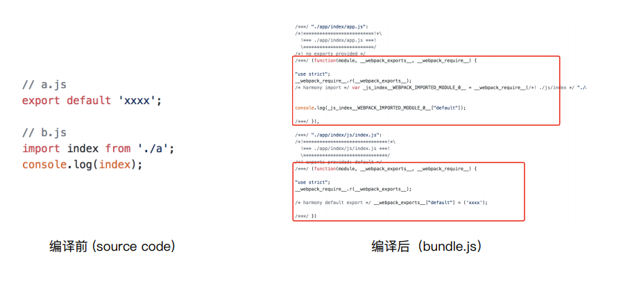
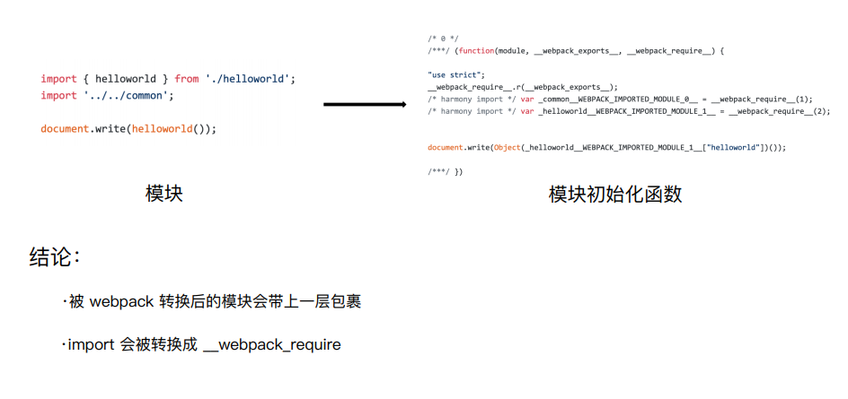
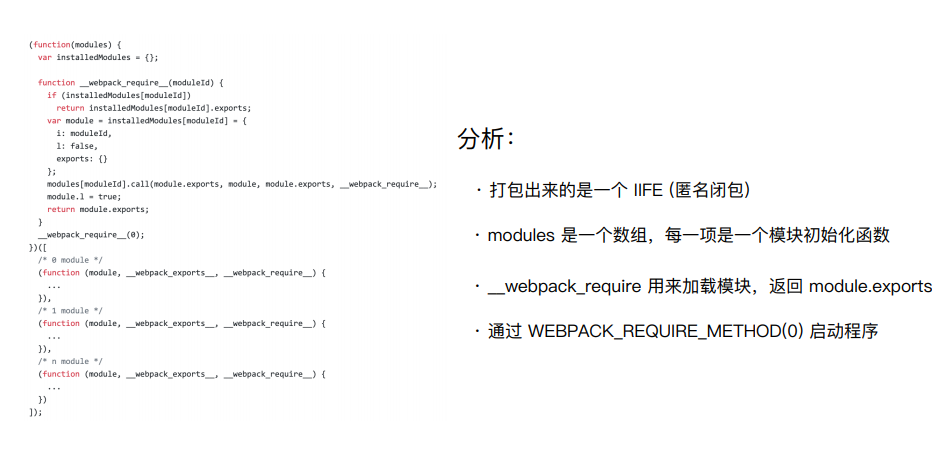
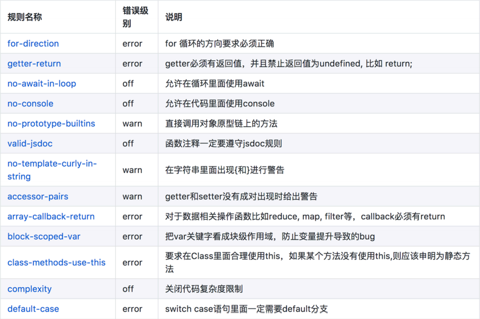
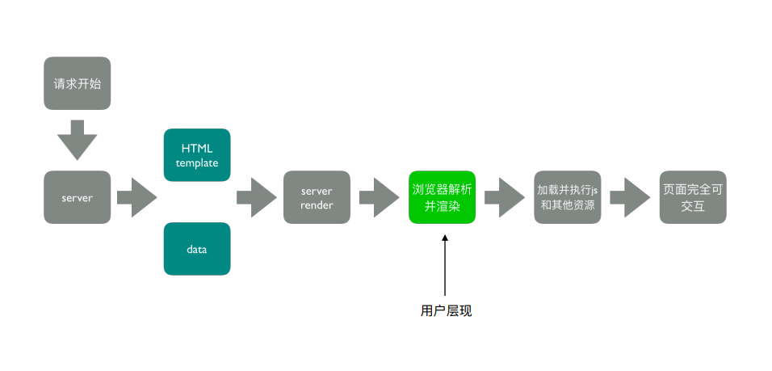

# webpack

* [1、本质](#1)
* [2、特点](#2)
  - [2.1、指定React元素类型](#2_1)

## <div id="1">内容</div>

### 极客课件和源代码下载地址

[课件](https://gitee.com/wdata/geektime-webpack-course)

## 第一章-简介

### 为什么需要构建工具

1. 转换ES6语法
2. 转换 JSX
3. CSS 前缀补全/预处理器
4. 压缩混淆
5. 图⽚压缩

### 为什么选择webpack

社区⽣态丰富
配置灵活和插件化扩展
官⽅更新迭代速度快

### webpack 配置组成

```js
{
  module.exports = {
    // 打包的⼊⼝⽂件
    entry: './src/index.js',
    // 打包的输出
    output: './dist/main.js',
    // 环境
    mode: 'production',
    module: {
      // Loader 配置
      rules: [{ 
        test: /\.txt$/,
        use: 'raw-loader'
      }]
    },
    // 插件配置
    plugins: [
      new HtmlwebpackPlugin({
        template: './src/index.html’
      })
    ]
  };
}
```

### 环境搭建：安装Node.js 和 NPM

1、安装 [nvm](https://github.com/nvm-sh/nvm)

```text
{
  1. 通过 curl 安装：curl -o- https://raw.githubusercontent.com/nvm-sh/nvm/v0.34.0/install.sh | bash
  2. 通过 wget 安装：wget -qO- https://raw.githubusercontent.com/nvm-sh/nvm/v0.34.0/install.sh | bash
}
```

2、安装 Node.js 和 NPM

```text
{
  1. nvm install v10.15.3
  2. 检查是否安装成功：node -v, npm -v
}
```

3、安装 webpack 和 webpack-cli
3.1、创建空⽬录和 package.json
3.2、安装 webpack 和 webpack-cli 
3.3、检查是否安装成功：./node_modules/.bin/webpack -v

## 第二章-基础用法

### 2.1 entry

Entry ⽤来指定 webpack 的打包⼊⼝

```js
{
  // 单⼊⼝
  module.exports = {
    entry: './path/to/my/entry/file.js'
  };

  // 多⼊⼝
  module.exports = {
    entry: {
      app: './src/app.js',
      adminApp: './src/adminApp.js'
    }
  };
}
```

### 2.2 output

Output ⽤来告诉 webpack 如何将编译后的⽂件输出到磁盘

```js
{
  // 单⼊⼝
  module.exports = {
    output: {
      filename: 'bundle.js’,
      path: __dirname + '/dist'
    }
  };

  // 多⼊⼝
  module.exports = {
    output: {
      filename: '[name].js',
      path: __dirname + '/dist'
    }
  };
}
```

### 2.3 loaders

webpack 开箱即用只支持 JS 和 JSON 两种文件类型，通过 Loaders 去支持其它文
件类型并且把它们转化成有效的模块，并且可以添加到依赖图中。

常见的Loaders：


```js
{
  module.exports = {
    module: {
      rules: [{
        // test 指定匹配规则
        test: /\.txt$/,
        // use 指定使⽤的 loader 名称
        use: 'raw-loader'
      }]
    }
  };
}
```

### 2.6 plugins

插件⽤于 bundle ⽂件的优化，资源管理和环境变量注⼊
作⽤于整个构建过程

常见的Loaders：


```js
{
  module.exports = {
    plugins: [
      // 放入 plugins中
      new HtmlWebpackPlugin({
        template: './src/index.html'
      })
    ]
  };
}
```

### 2.5 mode

Mode ⽤来指定当前的构建环境是：production、development 还是 none
设置 mode 可以使⽤ webpack 内置的函数，默认值为 production


### 2.6 解析ES6和React

```js
{ 
  // 资源解析：ES6
  // 使⽤ babel-loader babel的配置⽂件是：.babelrc
  module.exports = {
    module: {
      rules: [{
        test: /\.js$/,
        use: 'babel-loader'
      }]
    }
  };

  // 资源解析：增加ES6的babel preset配置
  {
    "presets": [
      "@babel/preset-env”
    ],
    "plugins": [
      "@babel/proposal-class-properties"
    ]
  }

  // 资源解析：解析 React JSX
  {
    "presets": [
      "@babel/preset-env",
      "@babel/preset-react"
    ],
    "plugins": [
      "@babel/proposal-class-properties"
    ]
  }

  // 资源解析：解析 CSS + 解析 Less 和 SaSS
  const MiniCssExtractPlugin = require('mini-css-extract-plugin') // 分离css文件
  module.exports = {
    module: {
      rules: [{
          test: /.css$/,
          // use: ['style-loader', 'css-loader']
          // MiniCssExtractPlugin 与 style.loader 互斥
          use: [MiniCssExtractPlugin.loader, 'css-loader']
        },
        {
          test: /.less$/,
          // use: ['style-loader', 'css-loader', 'less-loader']
          // MiniCssExtractPlugin 与 style.loader 互斥
          use: [
            MiniCssExtractPlugin.loader,
            'css-loader',
            {
              loader: 'px2rem-loader',
              options: {
                remUnit: 75, // rem 相对于转换的px单位 1rem = 75px
                remPrecision: 8 // px 转换成rem小数点位数
              }
            },
            'postcss-loader',
            'less-loader'
            // {
            //   loader: 'postcss-loader',
            //   // 为什么不这样写，要添加postcss.config.js，因为会报错，版本不兼容
            //   options: {
            //     plugins: () => {
            //       require('autoprefixer')({
            //         // 可选择兼容版本
            //         browsers: ['last 2 version', '>1%', 'ios 7']
            //       })
            //     }
            //   }
            // },
          ]
        },
      ]
    }
  };
}
```

### 2.7 解析图片和字体

```js
{
  // 解析图⽚
    {
    test: /.(png|jpg|gif|jpeg)$/,
    // 文件指纹
    use: [
      {
        loader: 'file-loader',
        options: {
          name: '[name]_[hash:8].[ext]'
        }
      }
    ]
  }

  // 资源解析：解析字体
  {
    test: /.(woff|woff2|eot|ttf|otf)$/,
    // use: 'file-loader'
    use: [
      {
        loader: 'file-loader',
        options: {
          name: '[name]_[hash:8].[ext]'
        }
      }
    ]
  }
}
```

### 2.8 文件监听

⽂件监听是在发现源码发⽣变化时，⾃动重新构建出新的输出⽂件。

插件：

1. webpack-dev-server

### 2.9 热更新

插件:

1. webpack-dev-middleware

热更新原理：


### 2.10 文件指纹

打包后输出的⽂件名的后缀

如何生成：

1. Hash：和整个项⽬的构建相关，只要项⽬⽂件有修改，整个项⽬构建的 hash 值就会更改
2. Chunkhash：和 webpack 打包的 chunk 有关，不同的 entry 会⽣成不同的 chunkhash 值
3. Contenthash：根据⽂件内容来定义 hash ，⽂件内容不变，则 contenthash 不变


```js
{
  // 生成8位数哈西
  // JS+CSS+图片
  '[name]_[hash:8].[ext]'
  '[name]_[chunkhash:8].js'
  '[name]_[Contenthash:8].[ext]'
}
```

### 2.11 压缩

插件：

1. 内置插件：uglifyjs-webpack-plugin
2. CSS文件压缩：optimize-css-assets-webpack-plugin
3. html ⽂件的压缩：html-webpack-plugin

## 第三章-进阶用法

### 3.1 自动清理output输出

插件：**clean-webpack-plugin**

```js
{
  const { CleanWebpackPlugin } = require('clean-webpack-plugin');
  plugins:[ new CleanWebpackPlugin() ]
}
```

### 3.2 补全CSS3前缀

插件：

1. postcss-loader - 解析成抽象语法树结构AST，并调用插件处理AST并得到结构
2. autoprefixer - 增加声明前缀

```js
{
  // 1、在module.rules.use 中添加 postcss-loader
  {
    test: /.less$/,
    use: [
      ...,
      {
        loader: 'postcss-loader'
        // 为什么不这样写，要添加postcss.config.js，因为会报错，版本不兼容
        // options: {
        //   plugins: () => {
        //     require('autoprefixer')({
        //       // 可选择兼容版本
        //       browsers: ['last 2 version', '>1%', 'ios 7']
        //     })
        //   }
        // }
      },
    ]
  }
  // 2、新建文件 postcss.config.js
  // 3、添加配置
  module.exports = {
    plugins: [
      require('autoprefixer')({
        // 可选择兼容版本
        // 为什么不用 browsers，因为会提示警告
        // browsers: ['last 2 version', '>1%', 'ios 7']
        overrideBrowserslist: ['last 2 version', '>1%', 'ios 7']
      })
    ]
  }
}
```

### 3.3 px转rem

原理：

1. rem：相对单位
2. px：绝对单位

插件：

1. px2rem-loader - 转换rem
2. lib-flexible - 渲染时计算根元素font-size值，**不能被压缩，需放在.html中**

坑：**px2rem-loader必须在less-loader之前**。
原因：px2rem-loader 不支持嵌套结构，webpack - use的执行顺序是从右往左方向；

```js
{
  // 引用
  // 
  {
    loader: 'px2rem-loader',
    options: {
      remUnit: 75, // rem 相对于转换的px单位 1rem = 75px
      remPrecision: 8 // px 转换成rem小数点位数
    }
  }
}
```

### 3.4 静态资源内联

代码层面：

1. 页面框架的初始化脚本
2. 上报相关打点
3. css内联比吗页面闪动

请求层面：减少HTTP网络请求数

1. 小图片或字体内联（url-loader）

插件：

1. raw-loader@0.5.1 - 内联html和js
2. style-loader 将css挂载到HTML中
3. html-inline-css-webpack-plugin

```js
{
  // 1、raw-loader
  // 原webpack视频中的方法
  // 添加meta
  ${ require('raw-loader!./meta.html') }
  // 添加文件自适应
  <script>
    ${ require('raw-loader!babel-loader!../node_modules/lib-flexible/flexible.js') }
  </script>
  // 实际的方法，原因：htmlwebpack-plugin的解析语法发生改变
  <%= require('raw-loader!./meta.html') %>
  <%= require('raw-loader!babel-loader!../node_modules/lib-flexible/flexible.js') %>


  // 2、style-loader 可用配置
  {
    'use': [
      {
        loader: 'style-loader',
        options: {
          insertAt: 'top', // 样式插入到 <head>
          singleton: true, // 将所有的style标签合并成一个
        }
      }
    ]
  }
}
```

### 3.5 多页面应用

每个页面对应entry，一个html-webpack-plugin

插件：

1. glob - 正则匹配文件，并返回文件，可对文件进行操作

```js
{
  // 固定的入口文件位置
  module.exports = {
    entry: {
      index: './src/index.js',
      search: './src/search.js'
    },
  }
  // 核心 - 通过glob拿取文件
  entry: glob.sync(path.join(_dirname, './src/*/index.js'))

  const setMPA = () => {
    const entry = {}
    const htmlWebpackPlugins = []
    // 拿到文件
    const entryFiles = glob.sync(path.join(__dirname, './src/*/index.js'))

    Object.keys(entryFiles).map((index) => {
      // 例如：E:/HTML/Github/notes/knowledge/webpack/code/project/src/search/index.js
      const entryFile = entryFiles[index]

      const match = entryFile.match(/src\/(.*)\/index\.js/)
      const pageName = match && match[1]

      entry[pageName] = entryFile

      htmlWebpackPlugins.push(
        new HtmlWebpackPlugin({
          template: path.join(__dirname, `src/${pageName}/index.html`), // 模版位置
          filename: `${pageName}.html`, // 指定打包出来的文件名称
          chunks: [pageName], // 生成的指定的chunks
          inject: true,
          minify: {
            html5: true,
            collapseWhitespace: true,
            preserveLineBreaks: false,
            minifyCSS: true,
            minifyJS: true,
            removeComments: false
          }
        })
      )
    })

    return {
      entry,
      htmlWebpackPlugins
    }
  }
  
  // 使用
  const { entry, htmlWebpackPlugins } = setMPA()
  // webpack配置
  module.exports = {
    entry: entry,
    plugins: [].concat(htmlWebpackPlugins)
  }
}
```

### 3.6 使用source map

通过 source map 定位到源代码

[source map科普⽂](http://www.ruanyifeng.com/blog/2013/01/javascript_source_map.html)

开发环境开启，线上环境关闭

线上排查问题的时候可以将 sourcemap 上传到错误监控系统

```text
{
  eval: 使⽤eval包裹模块代码
  source-map: 产⽣.map⽂件
  cheap: 不包含列信息
  inline: 将.map作为DataURI嵌⼊，不单独⽣成.map⽂件
  module:包含loader的sourcemap

  使用，在webpack添加：
  devtool: 'source-map' 配置等
}
```

### 3.7 提取公共资源

思路：将 react、react-dom 基础包通过 cdn 引⼊，不打⼊ bundle 中

插件：

1. html-webpackexternals-plugin - 基本库分离
2. splitChunksPlugin - 公共脚本分离 [文档](https://webpack.docschina.org/plugins/split-chunks-plugin/)

```js
{
  // splitChunksPlugin 配置
  module.exports = {
    optimization: {
      splitChunks: {
        /**
        chunks 参数说明：
          async 异步引⼊的库进⾏分离(默认)
          initial 同步引⼊的库进⾏分离
          all 所有引⼊的库进⾏分离(推荐)
         **/
        chunks: 'async',
        minSize: 30000, // 公共包最小大小
        maxSize: 0,
        minChunks: 1,
        maxAsyncRequests: 5,
        maxInitialRequests: 3,
        automaticNameDelimiter: '~',
        name: true,
        cacheGroups: {
          vendors: {
            test: /[\\/]node_modules[\\/]/,
            priority: -10
          }
        }
      }
    }
  };
}
```

### 3.8 Tree Shaking(摇树优化)

#### 概念

概念：1 个模块可能有多个⽅法，只要其中的某个⽅法使⽤到了，则整个⽂件都会被打到
bundle ⾥⾯去，tree shaking 就是只把⽤到的⽅法打⼊ bundle ，没⽤到的⽅法会在
uglify 阶段被擦除掉。
使⽤：webpack 默认⽀持，在 .babelrc ⾥设置 modules: false 即可
要求：必须是 ES6 的语法，CJS 的⽅式不⽀持

#### DCE (Dead code elimination)

1. 代码执⾏的结果不会被⽤到
2. 代码不会被执⾏，不可到达
3. 代码只会影响死变量（只写不读）

#### Tree-shaking 原理

利⽤ ES6 模块的特点:

1. 只能作为模块顶层的语句出现
2. import 的模块名只能是字符串常量
3. import binding 是 immutable的

代码擦除： uglify 阶段删除⽆⽤代码

### 3.9 scope hoisting

#### 问题

现象：构建后的代码存在⼤量闭包代码



⼤量作⽤域包裹代码，导致体积增⼤（模块越多越明显）

运⾏代码时创建的函数作⽤域变多，内存开销变⼤

#### 模块转换分析



#### 进⼀步分析 webpack 的模块机制



#### scope hoisting 原理

原理：将所有模块的代码按照引⽤顺序放在⼀个函数作⽤域⾥，然后适当的重命名⼀
些变量以防⽌变量名冲突

对⽐: 通过 scope hoisting 可以减少函数声明代码和内存开销

#### 使用

webpack mode 为 production 默认开启

必须是 ES6 语法，CJS 不⽀持

### 3.10、代码分割的意义

对于⼤的 Web 应⽤来讲，将所有的代码都放在⼀个⽂件中显然是不够有效的，特别是当你的
某些代码块是在某些特殊的时候才会被使⽤到。webpack 有⼀个功能就是将你的代码库分割成
chunks（语块），当代码运⾏到需要它们的时候再进⾏加载。

适⽤的场景：

1. 抽离相同代码到⼀个共享块
2. 脚本懒加载，使得初始下载的代码更⼩

方式：

1. CommonJS：require.ensure
2. **ES6：动态 import**（⽬前还没有原⽣⽀持，需要 babel 转换）

```js
{
  // 1、动态import
  // 安装babel插件
  npm install @babel/plugin-syntax-dynamic-import --save-dev

  // ES6：动态 import
  "plugins": ["@babel/plugin-syntax-dynamic-import"]
}
```

### 3.11、ESLint 的必要性

暴露明显的问题、统一风格、统一配置

ESLint：

1. Airbnb: eslint-config-airbnb、 eslint-config-airbnb-base
2. 腾讯alloyteam 团队 [eslint-config-alloy](https://github.com/AlloyTeam/eslint-config-alloy)
3. ivweb  团队：[eslint-config-ivweb](https://github.com/feflow/eslint-config-ivweb)

制定团队的 ESLint 规范：

1. 不重复造轮⼦，基于 eslint:recommend 配置并改进
2. 能够帮助发现代码错误的规则，全部开启
3. 帮助保持团队的代码⻛格统⼀，⽽不是限制开发体验



ESLint 如何执⾏落地？

1. CI/CD 系统集成
2. webpack 集成

```js
{
  // ⽅案⼀：webpack 与 CI/CD 集成
  // 本地开发阶段增加 precommit 钩⼦
  npm install husky --save-dev

  "scripts": {
    "precommit": "lint-staged"
  },
  "lint-staged": {
      "linters": {
          "*.{js,scss}": ["eslint --fix", "git add"]
      }
  },

  // ⽅案⼆：webpack 与 ESLint 集成
  // 使⽤ eslint-loader，构建时检查 JS 规范
  npm install eslint-loader --save-dev

  module.exports = {
    module: {
      rules: [{
        test: /\.js$/,
        exclude: /node_modules/,
        use: [
          "babel-loader",
          // 新增
          "eslint-loader"
        ]
      }]
    }
  }
}
```

### 3.12、webpack 打包库和组件

webpack 除了可以⽤来打包应⽤，也可以⽤来打包 js 库

#### 实现⼀个⼤整数加法库的打包

1. 需要打包压缩版和⾮压缩版本
2. ⽀持 AMD/CJS/ESM 模块引⼊

#### 库的⽬录结构和打包要求

打包输出的库名称:
·未压缩版 large-number.js
·压缩版 large-number.min.js

```cmd
{
  /dist
    large-number.js
    large-number.min.js
  webpack.config.js
  package.json
  index.js
  /src
    index.js
}
```

#### ⽀持的使⽤⽅式

```js
{
  // ⽀持 CJS
  import * as largeNumber from 'large-number';
  // ...
  largeNumber.add('999', '1');

  // ⽀持 ES module
  const largeNumbers = require('large-number');
  // ...
  largeNumber.add('999', '1');

  // ⽀持 AMD
  require(['large-number'], function (large-number) {
  // ...
  largeNumber.add('999', '1');
  });

  // 可以直接通过 script 引⼊
  <script src="https://unpkg.com/large-number"></script>
}
```

#### 如何将库暴露出去？

```js
{
  // library: 指定库的全局变量
  // libraryTarget: ⽀持库引⼊的⽅式

  module.exports = {
    mode: "production",
    entry: {
      "large-number": "./src/index.js",
      "large-number.min": "./src/index.js"
    },
    output: {
      filename: "[name].js",
      library: "largeNumber",
      libraryExport: "default",
      libraryTarget: "umd"
    }
  };
}
```

#### 设置⼊⼝⽂件

```js
{
  package.json 的 main 字段为 index.js
  if (process.env.NODE_ENV === "production") {
    module.exports = require("./dist/large-number.min.js");
  } else {
    module.exports = require("./dist/large-number.js");
  }
}
```

### 服务端渲染 (SSR)

是什么：渲染: HTML + CSS + JS + Data -> 渲染后的 HTML

服务端：

1. 所有模板等资源都存储在服务端
2. 内⽹机器拉取数据更快
3. ⼀个 HTML 返回所有数据

#### 浏览器和服务器交互流程



#### 客户端渲染 vs 服务端渲染

|          |                 客户端渲染                 | 服务端渲染           |
| -------- | :----------------------------------------: | -------------------- |
| 请求     |          多个请求（HTML、数据等）          | 1个请求              |
| 加载过程 |             HTML&数据串行加载              | 1个请求返回HTML&数据 |
| 渲染     |                  前端渲染                  | 服务端渲染           |
| 渲染     | 图片静态资源加载完成，JS逻辑执行完成可交互 | 与客户端渲染相同     |

优势：减少⽩屏时间、对于 SEO 友好

#### SSR 代码实现思路

服务端

1. 使⽤ react-dom/server 的 renderToString ⽅法将React 组件渲染成字符串
2. 服务端路由返回对应的模板

客户端

1. 打包出针对服务端的组件

打包之后出现提示：**self is not defined**问题

webpack ssr 打包存在的问题

1. 浏览器的全局变量 (Node.js 中没有 document, window)
      1. 组件适配：将不兼容的组件根据打包环境进⾏适配
      2. 请求适配：将 fetch 或者 ajax 发送请求的写法改成 isomorphic-fetch 或者 axios
2. 样式问题 (Node.js ⽆法解析 css)
      1. ⽅案⼀：服务端打包通过 ignore-loader 忽略掉 CSS 的解析
      2. ⽅案⼆：将 style-loader 替换成 isomorphic-style-loader

#### 如何解决样式不显示的问题？

1. 使⽤打包出来的浏览器端 html 为模板
2. 设置占位符，动态插⼊组件

#### ⾸屏数据如何处理？

1. 服务端获取数据
2. 替换占位符

### 3.13、当前构建时的⽇志显示
