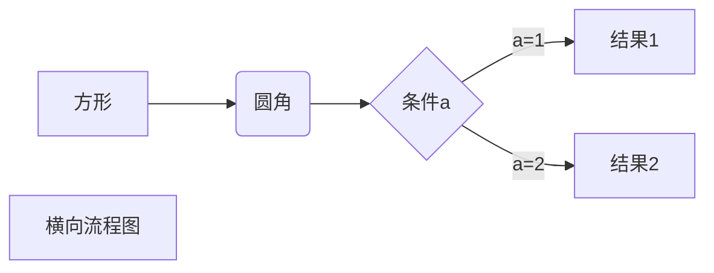
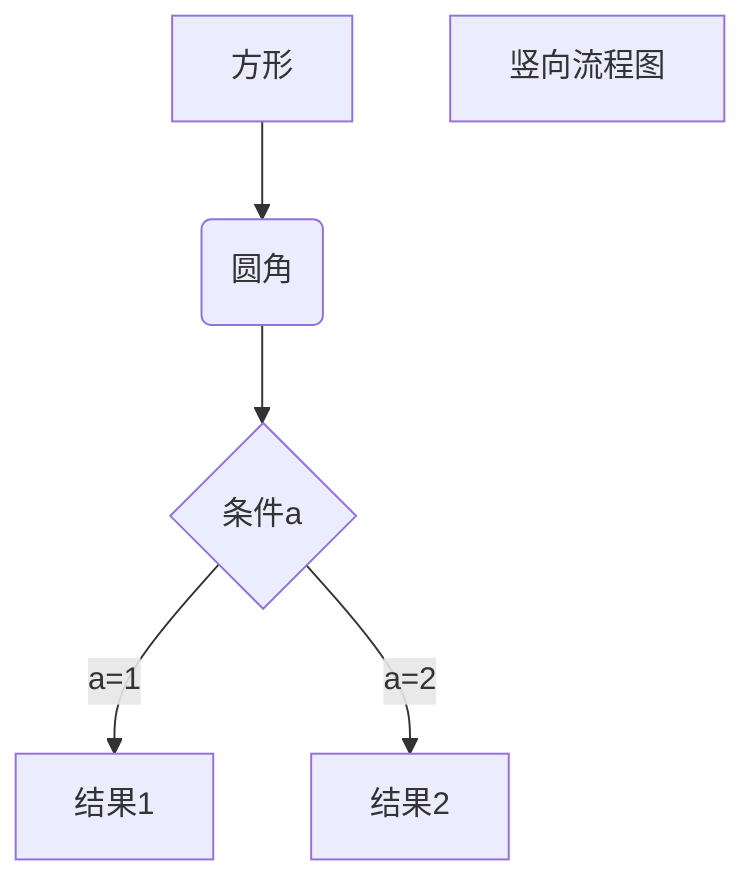
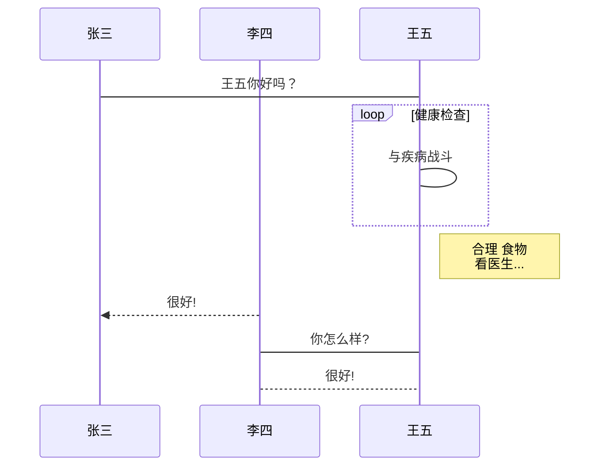
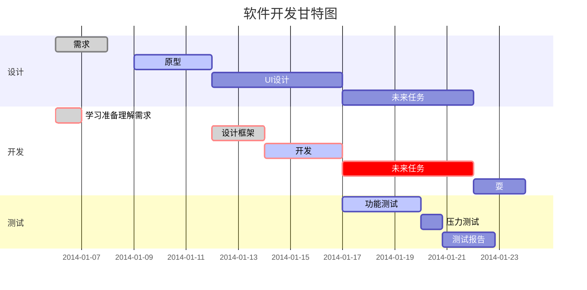

# 一级标题

## 二级标题

### 三级标题

#### 四级标题

##### 五级标题

###### 六级标题

####### 没有七级标题

这个是一级标题，没有限制，只要大于1就可以
=

这个是二级标题，-没有限制，只要大于1就可以
-


```js
{
   # 一级标题
   ## 二级标题
   ### 三级标题
   #### 四级标题
   ##### 五级标题
   ###### 六级标题
   ####### 没有七级标题
   # 一级标题 #
   ## 二级标题 ##
   ### 三级标题 ###
   #### 四级标题 ####
   ##### 五级标题 #####
   ###### 六级标题 ######
}
```

### 2、列表

#### 无序列表

* 1
* 2

+ 3
+ 4


- 5
- 6


```js
{
    * 1
    * 2
    + 3
    + 4
    - 5
    - 6
}
```

##### 无序列表可以用* ， + ， — 来创建

#### 有序列表

1. 有序列表1
2. 有序列表2
3. 有序列表3
4. 有序列表4
5. 有序列表5
6. 122222
7. 有序列表3
8. 有序列表8
9. 有序列表6
10. 有序列表1

##### 有序列表的序号是根据第一行列表的数字顺序来的

```text
{
    1. 有序列表1
    2. 有序列表2
    3. 有序列表3
    4. 有序列表4
    5. 有序列表5

    3. 有序列表3
    8. 有序列表8
    6. 有序列表6
    1. 有序列表1
}
```

### 3、引用

* 不以结婚为目的的谈恋爱都是刷流氓
  > 毛主席
* 前方高能
  > 注意：注意这是为了提醒前方有很刺激的事情发生，请
  做好准备；

## 标题

> * 不以结婚为目的的谈恋爱都是刷流氓
>   > 毛主席
> * 前方高能
>   > 注意：注意这是为了提醒前方有很刺激的事情发生，请
      做好准备；

> 一级引用
>> 二级引用
>>> 三级引用
>>>> 四级引用
>>>>> 五级引用
>>>>>> 六级引用
>>>>>>> 七级引用 多层嵌套的>是不需要连续在一起的，只要在一行就可以了

```text
{
    * 不以结婚为目的的谈恋爱都是刷流氓
      > 毛主席

    > ## 标题
    > * 不以结婚为目的的谈恋爱都是刷流氓
    >   > 毛主席
}
```

### 4、分割线

#### 分割线可以由* - _（星号，减号，底线）这3个符号的至少3个符号表示，注意至少要3个，且不需要连续，有空格也可以

*********************
* * *
---
 - - -
___
 _ _ _ _


### 5、链接

#### 支持2种链接方式：行内式和参数式

[一生一世](www.yishengyishi.com)当然不要真点

* [我是带链接的列表1](www)
* [我是带链接的列表2](www)
* [我是带链接的列表3](www)

#### 参数式

[百度]: www.baidu.com/ "我随便写的百度"
我要点击百度[百度],不点击[百度],不想点击[百度]

#### 支持

[foo]: http://example.com/ "Optional Title Here"
[foo]: http://example.com/ 'Optional Title Here'
[foo]: http://example.com/ (Optional Title Here)

#### 代码

```text
{
    行内式：[一生一世](www.yishengyishi.com)当然不要真点

    参数式：[百度]: www.baidu.com/ "我随便写的百度"
    我要点击百度[百度],不点击[百度],不想点击[百度]
}
```

### 6、图片

#### 图片分：行内式和参数式

#### 行内式


Inline-style:


#### 参数式

[logo]: https://github.com/adam-p/markdown-here/raw/master/src/common/images/icon48.png "Logo Title Text 2"
Reference-style: ![logo]

#### 代码


```text
{
    行内式：

}
```

有颜色的代码块

```javascript
{
  class CustomForm extends Component {
    handleSubmit = () => {
      console.log("Input Value: ", this.input.value)
    }
    render () {
      return (
        <form onSubmit={this.handleSubmit}>
          <input
            type='text'
            ref={(input) => this.input = input} />
          <button type='submit'>Submit</button>
        </form>
      )
    }
  }

  // 格式 - 添加javascript
  // ```编程语言名
  // 代码内容  
  // ```
}
```

上面的代码中，可以添加javascript（也可用js），或者java、python等

#### 7、代码框

#### 第一种 单引号 ``

`<p><h2>人生再说</h2></p>`

#### 第二种 多行用，上下每边3个`

``` 可以写注释
{    
    <p><h2>人生再说</h2></p>
    <p><h2>人生再说</h2></p>
    <p><h2>人生再说</h2></p>
}
```

### 8、表格

#### 第一种，:---: 表示居中, :--- 表示向左， ---: 表示向右，最少有三个---

|name|age|sex|
|:--- :|:---|---:|
|wang|21|男|
|yes|21|女|

```text
{
    |name|age|sex|
    |:--- :|:---|---:|
    |wang|21|男|
    |yes|21|女|
}
```

#### 第二种

| name | age | sex |
| ---- | --- |
| wang | 21  | 男  |
| yes  | 21  | 女  |

```text
{
    | name | age | sex |
    | ---- | --- |
    | wang | 21  | 男  |
    | yes  | 21  | 女  |
}
```

#### 第三种

| 学号 | 姓名  | 分数 |
| ---- | :---: | ---- |
| 1    | 小明  | 10   |
| 2    | 小红  | 100  |
| 3    | 小西  | 88   |

```text
{
    | 学号 | 姓名 | 分数 |
    | ---- | ---- | ---- |
    | 1    | 小明 | 10   |
    | 2    | 小红 | 100  |
    | 3    | 小西 | 88   |

    // :-:是居中
}
```

### 9、强调

*字体倾斜*
_字体倾斜_
**字体加粗**
__字体加粗__

```text
{
    *字体倾斜*
    _字体倾斜_
    **字体加粗**
    __字体加粗__
}
```

### 10、转义

* \\
* \`
* \~
* \*
* \_
* \-
* \+
* \.
* \!

```text
{
    * \\
    * \`
    * \~
    * \*
    * \_
    * \-
    * \+
    * \.
    * \!

    \   反斜线
    `   反引号
    *   星号
    _   下划线
    {}  花括号
    []  方括号
    ()  小括号
    #   井字号
    +   加号
    -   减号
    .   英文句点
    !   感叹号
}
```

### 11、删除线

~~删除线~~

```text
{
    ~~删除线~~
}
```

### 12、文字（字体、颜色）

```js
{

  // 普通黑底的字体
  <font face="黑体">我是黑体字</font>
  <font face="微软雅黑">我是微软雅黑</font>
  <font face="STCAIYUN">我是华文彩云</font>
  <font color=#0099ff size=3 face="黑体">color=#0099ff size=3 face="黑体"</font>
  <font color=#00ffff size=4>color=#00ffff size=4</font>
  <font color=gray size=5>color=gray size=5</font>

  // 背景颜色
  <table><tr><td bgcolor=PowderBlue>这里的背景色是：PowderBlue，  十六进制颜色值： #B0E0E6，rgb(176, 224, 230)</td></tr></table>
}
```

普通黑底的字体

<font face="黑体">我是黑体字</font>

<font face="微软雅黑">我是微软雅黑</font>
<font face="STCAIYUN">我是华文彩云</font>
<font color=#0099ff size=3 face="黑体">color=#0099ff size=3 face="黑体"</font>
<font color=#00ffff size=4>color=#00ffff size=4</font>
<font color=gray size=5>color=gray size=5</font>

<table><tr><td bgcolor=PowderBlue>这里的背景色是：PowderBlue，  十六进制颜色值： #B0E0E6，rgb(176, 224, 230)</td></tr></table>

```text
{
  `文字高亮` ``文字高亮`` ```文字高亮```
}
```

`文字高亮` ``文字高亮`` ```文字高亮```

<br />

### 13、高级用法





```flow
st=>start: 开始框
op=>operation: 处理框
cond=>condition: 判断框(是或否?)
sub1=>subroutine: 子流程
io=>inputoutput: 输入输出框
e=>end: 结束框
st->op->cond
cond(yes)->io->e
cond(no)->sub1(right)->op
```

```flow
st=>start: 开始框
op=>operation: 处理框
cond=>condition: 判断框(是或否?)
sub1=>subroutine: 子流程
io=>inputoutput: 输入输出框
e=>end: 结束框
st(right)->op(right)->cond
cond(yes)->io(bottom)->e
cond(no)->sub1(right)->op
```

```sequence
对象A->对象B: 对象B你好吗?（请求）
Note right of 对象B: 对象B的描述
Note left of 对象A: 对象A的描述(提示)
对象B-->对象A: 我很好(响应)
对象A->对象B: 你真的好吗？
```

```sequence
Title: 标题：复杂使用
对象A->对象B: 对象B你好吗?（请求）
Note right of 对象B: 对象B的描述
Note left of 对象A: 对象A的描述(提示)
对象B-->对象A: 我很好(响应)
对象B->小三: 你好吗
小三-->>对象A: 对象B找我了
对象A->对象B: 你真的好吗？
Note over 小三,对象B: 我们是朋友
participant C
Note right of C: 没人陪我玩
```




