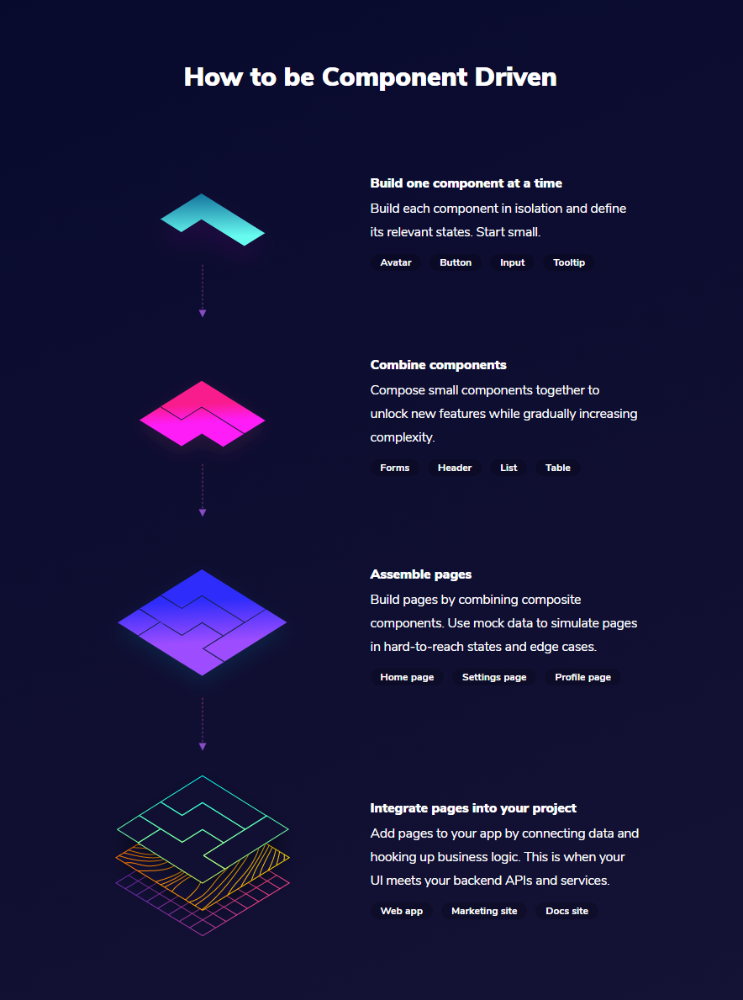

# 组件驱动设计（CDD）

**CDD**指的是**Component Driven Development**，译为**组件驱动设计**。

## 1、前言

Web前端蓬勃发展，从

**React**和**Vue**等UI组件库大行其道，组件式开发深入人心。我们已经知道使用组件开发，是封装、重用样式和功能的好办法。

**什么是组件**：组件是标准化的、可互换的UI构建块，它们封装了UI部分的外观和功能。

**什么是组件驱动设计**：它是一种开发方法，它围绕组件构建项目。是一个**自下而上**构建UI的过程，从**原子级别**的组件开始，到整体的页面级别结束。

组件驱动的开发意味着设计的**软件应用**是通过**构建松散耦合的独立组件**创建的，而根据**康威定律**表明，这意味着可以用类似的方式设计新的系统。

## 2、开发人员和设计人员

尽管我们的大多数人已经在日常中接收和使用组件开发，但是我们可能并没有很好的高效使用它。

一般的开发过程是，由设计人员提供高保真，再由开发人员**基于高保真开发**网站。每个页面可能分为第一版，第二版，第三版，在较长的开发时间中设计人员和开发人员可能并一直是同一人。

设计人员对高保真的设计有极大的主观性，时间和页面的不一致可能会导致看起来**相同的组件有完全不同的效果**。或者功能是一致的，但是展示的方式却不尽相同。例如：前期有一个列表，后期可能又有一个类似的列表，但是新添加了折叠和跳转功能。开发人员一开始可能只是将列表写在页面上，后续再其他页面新添加类似列表时可能也只是复制样式，再写一份新的代码。

开发人员根据高保真拆解时，会主动的将一个个物件，拆分成组件：基础组件、项目通用组件、业务组件、模块内部小组件，而在拆解时一般不会考虑较久远后页面的使用。在后续页面开发时，如果看到后续类似的组件时，可能会去代码内查询。如果碰到样式一致，但功能不一致时，考虑到对以前的代码的影响，会复制一份代码，写一个新的组件。

在设计人员和开发人员交流沟通时，可能更多的考虑需求的实现。设计人员不会专门为组件设计效果和功能，并连贯的做下去。而开发人员在设计组件时，也不会询问设计人员后续的规划等。

开发人员可能会抱怨：**一个设计人员从不重复使用完全相同的组件两次**。

设计人员可能也会抱怨：**为什么开发人员无法在第一次尝试时做出扩展**。

能改进的地方

1. 设计人员和开发彼此使用的**语言**并不一致，不能很好的沟通；
2. 设计人员可能会重用原来的物件，但是会修改它，并孤立的设计在页面上；
3. 开发可能并没有重构原来的代码，而是通过添加新组件完成任务；

## 3、组件作为语言工具

在基于组件的开发中，**我们通过创建并明确指定和记录的小块界面来构建 UI**。那些小的 UI 就是我们将要调用的**组件**。它们可以一起使用来创建越来越复杂的布局和功能，最后，通过组合创建新的屏幕。

组件可以定义为一个**独立的界面单元**，用于处理应用程序中特定用例的**视觉效果（样式）、交互（行为）和目的（功能）**。组件具有以下属性：

1. **复用性**，组件是独立的，可在不同的系统中重复使用；
2. **一致性**，它需要有**视觉的一致性**，意味着为颜色、字体、大小、位置和视觉语言的所有其他部分创建统一的样式指南标准。
3. **配置性**，通过自定参数，配置不同的模式；

在组件驱动设计中，我们重点将放在**如何创建屏幕的每个部分，以便它们可以独立工作**，但以协调的方式使屏幕按要求工作。即使我们的目标是交付屏幕，我们也在超前思考：**制造这些组件是为了在未来重复使用**。

## 4、基于组件的方法

我们在开发页面时，可以尝试使用基于组件的方法：

1. 开发人员在查看页面时，与其他页面相比较，以**确定哪些需要提取组件**；
2. **与设计沟通**后，他们确定需要将这些组件写成一种新的语言；
3. 设计人员将这些**组件建模，识别出以前和现在的模式，以及每种不同的变化**；
4. 开发人员可通过**参数的配置将其开发为通用的组件**；
5. 设计人员验证组件的**视觉效果一致性和功能完整性**；
6. 开发人员用组件**构建页面**；
7. 设计人员**验证页面**是否正确；

在新的开发过程中，有以下的好处：

1. 页面不仅仅是唯一的结果。从开发人员看：他设计了新的组件，可以根据需要配置和使用；从设计人员看：他多了新的物件，他可以在后续的设计中重复使用它们；
2. 由于组件是设计人员和开发人员共同创建的，因此它们的沟通得到改善。新的页面需要添加组件时，可以很快的实现它，而不用更多的时间；
3. 如果对组件有调整时，设计人员将会有通盘的考虑，并会仔细考虑模式的设计，而开发人员也能更快的进行调整；
4. 另一方法，也能迫使设计人员**对组件有更多的思考，将有更精细化的设计**；
5. 如果组件有较好的积累，在新页面时，只需要**将原来的组件拖拽放置在相应的地方**就可以完成；
6. 在人员更换方面，组件的重复使用和维护，即可以**保证页面视觉风格的延续**，更能**节省开发时间**；

相对于基于页面开发，基于组件开发有更大的优势：

1. **质量**，组件是独立构建的，有通盘的考虑和细致的设计，并有详细的文档；
2. **耐用性**，组件将更具有可用性，不管是设计人员或开发人员，都将在其他页面上使用它；
3. **速度**，用组件搭建页面，将速度更快；
4. **效率**，以组件作为团队间共享的语言，将可以共享开发和设计；

## 5、思考

1、React、Vue框架，Element UI组件库等都是组件化的体现，为什么Web页面往组件化发展？

在网站的初始时期，网站的实现全部依靠程序员的个人智慧实现，这其中有非常大的主观性和不可靠性，这导致网站开发时间和质量不可控。而如果依靠大力出奇迹，则后续维护有非常的繁琐和麻烦。

中期的Jquery和ExtJs就是一种优化，减少了重复的函数和功能的。将页面中一些功能完全一致的组件封装起来，极大的减少了网站的开发时间，同时降低了程序员的门槛。

现在Angular、React、Vue的崛起，就是程序员共同选择的发展方向。它们降低了搭建组件的门槛，提供更方便的组件使用方法，使得组件能轻易完成。使用组件搭建页面成为一种简单的开发方式，程序员可以将页面上的一切物件都开发为组件。

全世界80%以上的网站都是重复的简单网站，其他20%的网站又有80%的页面是由可重复使用的组件构成。将开发网站像流水线一样，使用组件搭建网站就成为一种共同的选择。

2、组件驱动化设计又会往哪个方向发展？

1. **前端可视化构建**：例如公司内部的超级表单、阿里巴巴的[飞冰](https://ice.work/)，后台页面的一体化解决方案，通过海量的物料和淘宝前端的最佳实践方案可以极速生成一个网站。
2. **微前端+组件化**：将一个大的项目按模块拆分成小模块，使用组件快速搭建，构建视觉风格统一的网站。
3. **组件共享**：国外的[Bit Dev](https://github.com/teambit/bit)，一个用于组件驱动应用程序的开放基础架构，依靠众多的前端和设计开发了非常的前端组件，在搭建页面时可以随意使用它们，可以帮助用户快速的生成视觉效果一致的页面。

3、项目组内应该如何使用组件驱动设计？

1. 开发人员和设计人员可以共同设计组件，设计统一的视觉风格，并在后续的页面中重复使用这些组件；
2. 搭建[storybook](https://storybook.js.org)的系统，构建一套组件官网，完整的显示组件的功能、文档、用例，方便但组件的测试；
3. 在开发过程中，将组件通用化设计，并尽量做到原子级，并将组件装入搭建的系统中；

## 6、引用

[组件驱动设计 - 一个大致介绍的网站](https://www.componentdriven.org/)
[什么是组件驱动开发以及为什么要使用它](https://medium.com/@arqex/what-is-component-driven-development-and-why-to-use-it-e3e57abbc449)
[Bit Dev 他们是如何构建组件驱动设计的](https://blog.bitsrc.io/how-we-build-our-design-system-15713a1f1833)
[Bit Dev 他们是怎么使用的微前端](https://blog.bitsrc.io/how-we-build-micro-front-ends-d3eeeac0acfc)
[设计人员眼中的原子设计](https://uxdesign.cc/atomic-design-how-to-design-systems-of-components-ab41f24f260e)
